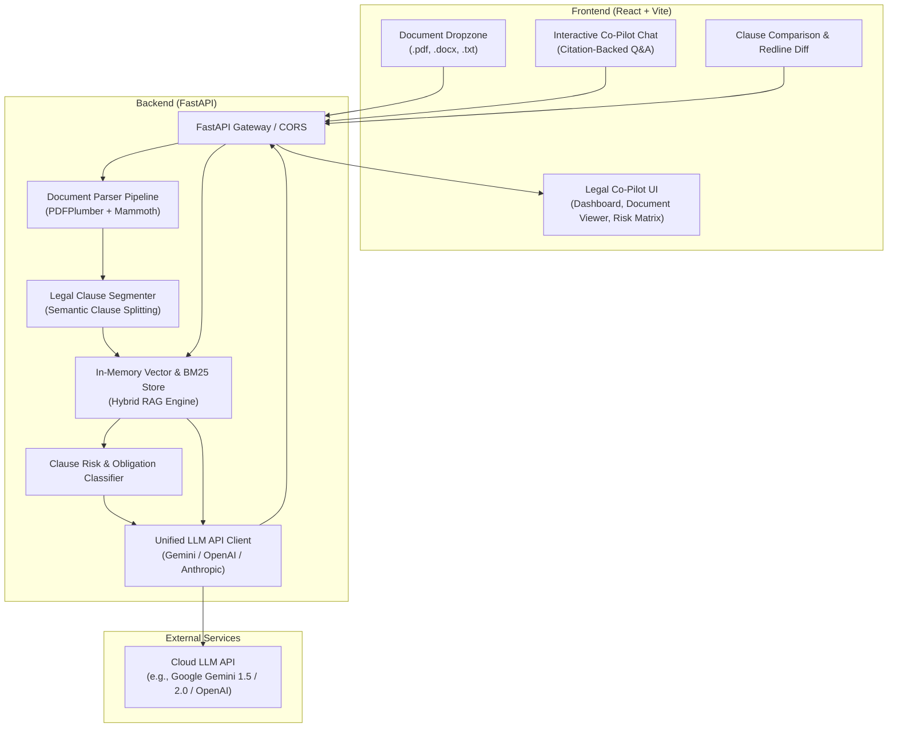

# CLARITY — AI Legal Co-Pilot: Project Audit & Architecture Assessment

**Date:** 2026-09-23  
**Auditor:** Lead Software Architect & Senior Full-Stack Engineer  
**Project Workspace:** `d:/legalAi`

---

## 1. Executive Summary & Repository Status

A full inspection of `d:/legalAi` was performed. The repository is currently a **clean slate (empty directory)** ready for structured implementation. There is no legacy code, tech debt, or outdated dependencies to refactor. 

This presents an optimal opportunity to build **CLARITY — AI LEGAL CO-PILOT** following a lightweight, modular, and production-grade architecture that strictly meets all hackathon/submission constraints:
* **Total repository size footprint:** < 10 MB (excluding virtual environments / `node_modules`).
* **Zero local model weight overhead:** 100% cloud LLM API integration.
* **Minimal infrastructure requirements:** In-memory / lightweight retrieval with zero external heavyweight database dependencies.

---

## 2. 15-Point Repository Inspection & Baseline Analysis

| # | Inspection Item | Current Status | MVP Target Specification |
|---|---|---|---|
| **1** | **Project Structure** | Empty root directory | Clean monorepo (`frontend/`, `backend/`, `docs/`, `tests/`) |
| **2** | **Frontend Framework** | None | **React + Vite** (Fast, modern, zero boilerplate, responsive) |
| **3** | **Backend Framework** | None | **FastAPI (Python 3.10+)** (Asynchronous, type-safe with Pydantic, high performance) |
| **4** | **Existing APIs** | None | RESTful endpoints: `/api/upload`, `/api/analyze`, `/api/query`, `/api/export`, `/api/health` |
| **5** | **AI Integrations** | None | External LLM API (Google Gemini / OpenAI / Anthropic via unified provider interface) |
| **6** | **Document Processing** | None | `pdfplumber` (PDF layout/text extraction) & `mammoth` (DOCX extraction) |
| **7** | **Authentication** | None | Lightweight session/API-key based or stateless client token (Zero-friction for demo/MVP) |
| **8** | **Storage & Database** | None | In-memory Vector Index (NumPy cosine similarity / FAISS-cpu) + JSON/SQLite local cache |
| **9** | **UI Components** | None | Tailored modern Legal UI: Clause Inspector, Risk Matrix, Redlining Diff, Chat Drawer |
| **10** | **Environment Variables** | None | Standard `.env` (`LLM_API_KEY`, `LLM_PROVIDER`, `EMBEDDING_PROVIDER`, `PORT`) |
| **11** | **Incomplete/Broken Features**| None | Clean start |
| **12** | **Duplicated Code** | None | DRY architecture with shared schemas between client & server |
| **13** | **Dead Code** | None | Zero dead code policy |
| **14** | **Security Issues** | None | File sanitization, MIME-type validation, token limits, and prompt-injection mitigations planned |
| **15** | **Deployment Configuration** | None | Single `docker-compose.yml` or dual dev runners (`npm run dev` + `uvicorn main:app`) |

---

## 3. Recommended Architecture

### Key Architectural Decisions:
1. **Backend (FastAPI)**:
   - Native integration with Python's premier document parsing ecosystem (`pdfplumber`, `mammoth`).
   - Built-in validation with Pydantic v2 ensures typed communication with the React frontend.
   - Non-blocking async endpoints for smooth LLM streaming and document chunking.

2. **Parsing & Chunking Pipeline**:
   - **PDF**: `pdfplumber` preserves table coordinates and paragraph boundaries, essential for legal agreements.
   - **DOCX**: `mammoth` extracts clean HTML/plain text preserving legal hierarchies (sections, subsections, numbering).
   - **Clause Segmentation**: Rule-assisted regex + sliding-window chunker preserving section references (e.g., "Section 12.3 Indemnification").

3. **In-Memory Retrieval Engine (Hybrid Dense + Sparse)**:
   - In-memory vector store using NumPy cosine similarity / `scikit-learn` or lightweight `faiss-cpu`.
   - BM25 keyword matching fallback for precise legal terms of art and clause numbers.
   - No heavyweight external databases (no PostgreSQL, no Pinecone/Milvus server needed).

4. **Frontend (React + Vite)**:
   - Clean, high-performance responsive interface designed for legal practitioners.
   - Split-screen layout: **Document Viewer / Clause Navigator** on the left, **Risk Assessment & Legal Chat Co-Pilot** on the right.
   - Rich interactive features: Color-coded risk badges (High / Medium / Low), clause redlining, and citation highlighting.

---

## 4. Dependency Assessment

### Backend (`requirements.txt`)
* `fastapi>=0.110.0` & `uvicorn[standard]>=0.28.0` — Core API framework.
* `pydantic>=2.6.0` — Data validation.
* `pdfplumber>=0.11.0` — Robust PDF parsing with table extraction.
* `mammoth>=1.8.0` — Word `.docx` parsing.
* `numpy>=1.26.0` & `scikit-learn>=1.4.0` — In-memory embeddings math & similarity ranking.
* `google-genai>=1.0.0` / `google-generativeai` OR `httpx>=0.27.0` — External API communication.
* `python-multipart>=0.0.9` — Multipart upload support.
* `python-dotenv>=1.0.1` — Environment variable loader.

### Frontend (`package.json`)
* `react`, `react-dom` — Core UI library.
* `vite` — Ultra-fast build tool and dev server.
* `lucide-react` — Crisp iconography for legal actions.
* `diff` or simple text-diff utility — Visual redlining and contract revisions.

---

## 5. Security & Performance Considerations

1. **Security**:
   - **Client-Side File Sanitization**: File type and size verification before processing.
   - **In-Memory Only Option**: Document contents and embeddings can be retained exclusively in memory and discarded upon session close for client confidentiality.
   - **API Key Guarding**: LLM API keys stored purely in server-side environment variables; never exposed to the client.
   - **Prompt Injection Defense**: Clear delimiter wrapping (`<DOCUMENT_CONTEXT>`) and strict system prompt boundaries.

2. **Performance**:
   - **Instant Parsing**: `pdfplumber` and `mammoth` parse multi-page contracts in < 1-2 seconds.
   - **Zero-Latency Search**: In-memory cosine search over ~100-500 contract chunks takes < 5ms.
   - **Streaming Responses**: Stream LLM output to frontend for immediate perceived responsiveness.

---

## 6. MVP Priorities & Minimal Implementation Path

To deliver a complete, impressive, and fully functional MVP under strict size limits, the implementation is broken down into 4 focused phases:

### Phase 1: Core Engine & Document Parser (Backend)
* Scaffold FastAPI project structure with CORS, config, and error handlers.
* Implement `pdfplumber` and `mammoth` parsing services with clause boundary detection.
* Build in-memory vector index + similarity search service.
* Integrate cloud LLM client with structured legal analysis prompts (Risk extraction, Clause classification, Summarization).

### Phase 2: REST Endpoints & Orchestration (Backend)
* `POST /api/upload`: Parse and segment uploaded document.
* `POST /api/analyze`: Run automated legal risk audit (find high-risk indemnities, non-standard liabilities, termination traps).
* `POST /api/chat`: Multi-turn conversational RAG with exact document chunk citations.
* `POST /api/redline`: Generate suggested clause revisions and diffs.

### Phase 3: Modern Legal Co-Pilot UI (Frontend)
* Scaffold React + Vite application.
* Build split-view Workspace:
  - Document Explorer & Clause Navigator.
  - Risk Audit Dashboard (Severity score, categorized risk tags).
  - Co-Pilot Chat Drawer with citation clicks highlighting source text.
  - Clause Redlining / Comparison viewer.
* Connect all API services with error handling and loading indicators.

### Phase 4: Sample Documents, Testing & Polish
* Provide sample legal contracts (e.g., NDA, SaaS Agreement, Employment Agreement) for instant 1-click testing.
* Verification of bundle size (< 10MB clean repository footprint).
* Write comprehensive `README.md` with 1-command startup instructions.
