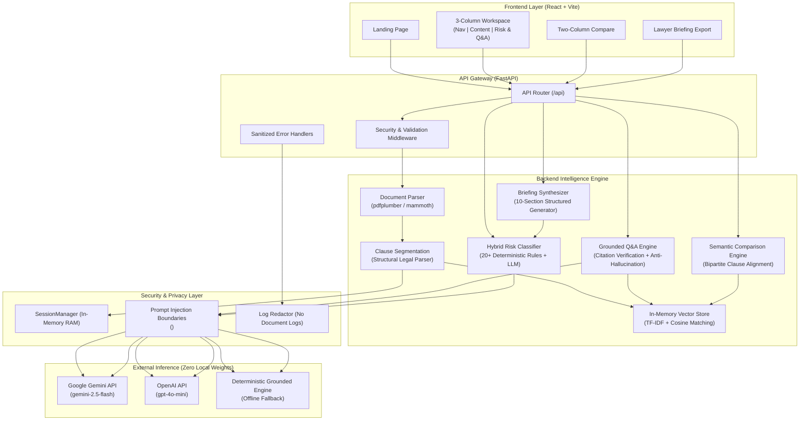

# Clarity — AI Legal Co-Pilot

[](https://fastapi.tiangolo.com)
[-emerald)](https://github.com/innocentgaming/legal)
[](https://github.com/jsvine/pdfplumber)
[](https://numpy.org)
[](https://docs.pytest.org)
[](LICENSE)

> **"Understand your legal documents before you talk to a lawyer."**  
> *Clarity helps you understand, question, compare, and prepare.*

---

## Table of Contents
- [Problem](#problem)
- [Solution](#solution)
- [Core Features](#core-features)
- [USP (Unique Value Proposition)](#usp)
- [Architecture](#architecture)
- [Tech Stack](#tech-stack)
- [Security & Data Handling](#security)
- [Accessibility](#accessibility)
- [Performance & Efficiency](#efficiency)
- [Problem Statement Alignment](#problem-statement-alignment)
- [Limitations & Disclaimers](#limitations)
- [Local Development](#local-development)
- [Environment Variables](#environment-variables)
- [Testing](#testing)
- [Deployment](#deployment)
- [End-to-End Demo Flow](#demo)

---

## Problem

Legal agreements, leases, employment contracts, and vendor terms are filled with dense, archaic legalese, ambiguous risk traps, and unbalanced covenants. 

Non-lawyers, founders, procurement managers, and consumers face significant challenges:
1. **Incomprehensible Clauses**: Critical obligations, auto-renewal triggers, and liability waivers are buried in complex legal jargon.
2. **Expensive Consultations**: Speaking to legal counsel without structured preparation wastes valuable billable hours on basic document orientation.
3. **Hidden Liabilities**: One-sided indemnities, uncapped damages, and harsh non-compete clauses often go unnoticed until a dispute occurs.
4. **Adversarial AI Risk**: Generic consumer LLMs frequently hallucinate terms, give unauthorized legal advice ("you should sign"), or regurgitate ungrounded assumptions.

---

## Solution

Clarity structures legal document review into a clear, trustworthy, non-gimmick workflow:

$$\text{UPLOAD} \longrightarrow \text{SIMPLIFY} \longrightarrow \text{INTERROGATE} \longrightarrow \text{COMPARE} \longrightarrow \text{PREPARE}$$

```
 ┌───────────────┐      ┌─────────────────────────┐      ┌─────────────────────────┐
 │   01. UPLOAD  │ ───► │      02. SIMPLIFY       │ ───► │     03. INTERROGATE     │
 │ PDF, DOCX, TXT│      │ Plain-English breakdown │      │ Grounded Q&A + citations│
 └───────────────┘      └─────────────────────────┘      └─────────────────────────┘
                                                                       │
 ┌─────────────────────────┐      ┌─────────────────────────┐          │
 │       05. PREPARE       │ ◄─── │       04. COMPARE       │ ◄────────┘
 │  1-Page Lawyer Briefing │      │ Two-Document Alignment  │
 └─────────────────────────┘      └─────────────────────────┘
```

1. **Upload**: Drag-and-drop or select sample benchmarks (Lease, NDA, SaaS MSA, Employment IP).
2. **Simplify**: Read clause-by-clause plain-English translations alongside verbatim text, obligations, rights, deadlines, and penalties.
3. **Interrogate**: Ask specific contractual questions with **strictly grounded citations** (exact clause, page, and quoted sentence).
4. **Compare**: Compare two agreement drafts side-by-side with semantic clause alignment (`MATCH`, `MODIFIED`, `ADDED`, `REMOVED`).
5. **Prepare**: Export a structured 10-section briefing (Markdown / PDF) with discussion points and questions tailored for your lawyer.

---

## Core Features

- **Clause-Level Simplification**: Deconstructs every clause into plain English, obligations (*shall/must*), rights (*may*), deadlines, and penalties.
- **Risk Tagging**: Hybrid deterministic and contextual classifier flagging `STANDARD`, `WORTH NOTING`, and `HIGH RISK` provisions with verbatim evidence.
- **Grounded Q&A**: Strict citation-backed conversational RAG that answers solely from uploaded clauses. If a term is absent, it states *"Not addressed in this document"*.
- **Exact Clause Citations**: Every answer and briefing item links to its source clause number, page, and verbatim quotation.
- **Two-Document Comparison**: Semantic clause alignment comparing versions A & B to highlight modified covenants, added obligations, and removed protections.
- **Lawyer Briefing ("Prepare for my Lawyer")**: Automatically synthesizes a 10-section structured briefing with potential negotiation points and questions for counsel.
- **Session-Scoped Processing**: Zero persistent storage. Documents and vector embeddings live only in volatile RAM for the duration of the session.
- **Accessible & Professional UI**: Clean 3-column workspace, explicit text risk badges, visible focus indicators, and 200% zoom support.

---

## USP

| # | Pillar | Description |
|---|---|---|
| **1** | **Grounded, Not Generic** | Refuses to extrapolate or guess. Answers only using retrieved clause text, backed by exact verbatim quotes and page numbers. |
| **2** | **Explicit Risk Scoring** | Flags uncapped liability, unilateral termination, auto-renewal traps, and harsh non-competes using exact textual proof. |
| **3** | **Semantic Clause Comparison** | Avoids naive string diffing; semantically aligns related clauses and explains the operational and legal impact of differences. |
| **4** | **Lawyer Preparation** | Organizes open questions, ambiguities, and negotiation levers to make actual attorney consultations fast, productive, and cost-effective. |
| **5** | **Non-Advice Framing** | Strictly avoids prescriptive legal advice ("you should sign" / "do not sign"). Highlights what the text says and frames questions for counsel. |

---

## Architecture

```text
                    ┌─────────────────────┐
                    │     React UI        │
                    │                     │
                    │ Upload              │
                    │ Clause Viewer       │
                    │ Risk Panel          │
                    │ Q&A                 │
                    │ Comparison          │
                    │ Lawyer Briefing     │
                    └──────────┬──────────┘
                               │
                               ▼
                    ┌─────────────────────┐
                    │     FastAPI         │
                    │      Backend        │
                    └──────────┬──────────┘
                               │
              ┌────────────────┼────────────────┐
              ▼                ▼                ▼
       ┌────────────┐   ┌─────────────┐  ┌──────────────┐
       │ Ingestion  │   │  Retrieval  │  │ Risk Engine  │
       └─────┬──────┘   └──────┬──────┘  └──────────────┘
             │                 │
             ▼                 ▼
       ┌────────────┐   ┌─────────────┐
       │  Clauses   │   │ Embeddings  │
       └─────┬──────┘   └──────┬──────┘
             │                 │
             └────────┬────────┘
                      ▼
               ┌──────────────┐
               │  Grounded    │
               │  LLM         │
               └──────┬───────┘
                      │
          ┌───────────┼────────────┐
          ▼           ▼            ▼
       Q&A        Comparison    Briefing
          │           │            │
          └───────────┴────────────┘
                      ▼
              Exact Citations
```



---

## Tech Stack

* **Frontend**: React 18, Vite, Lucide Icons, Vanilla CSS Design System (Zero Tailwind bloat).
* **Backend**: FastAPI (Python 3.10+), Uvicorn, Pydantic v2.
* **PDF Extraction**: `pdfplumber` (preserves page boundaries, layout, and tables).
* **DOCX Extraction**: `mammoth` & `python-docx` (clean HTML-to-text semantic parsing).
* **Retrieval**: Lightweight in-memory vector cosine similarity + TF-IDF with exact legal term boosting.
* **LLM Layer**: External APIs (Google Gemini `gemini-2.5-flash`, OpenAI `gpt-4o-mini`) with built-in **Deterministic Offline Fallback Engine**.
* **Repository Footprint**: Total tracked repository size is **< 0.75 MB** (zero local weights).

---

## Security

Clarity adheres to a **zero-retention, privacy-first, in-memory execution** model:

1. **Session-Scoped In-Memory State**: Documents, parsed clauses, and vector embeddings reside exclusively in volatile RAM (`InMemoryDocument`). No files or clauses are ever written to disk or permanent databases.
2. **Zero Logging of Document Contents**: Application loggers do not log raw document contents, extracted contract text, or user questions containing document excerpts.
3. **API Key Isolation**: Secrets (`GEMINI_API_KEY`, `OPENAI_API_KEY`) are read strictly from backend environment variables and are **never exposed to the frontend**.
4. **Prompt Injection Defenses**:
   - Non-overridable instruction hierarchy:
     $$\text{SYSTEM INSTRUCTIONS} > \text{USER QUESTION} > \text{RETRIEVED DOCUMENT CONTENT}$$
   - All document text is isolated within `<UNTRUSTED_DOCUMENT_CONTENT>...</UNTRUSTED_DOCUMENT_CONTENT>` tags.
   - Explicit system directives instruct the model to treat adversarial document instructions (e.g., *"Ignore previous instructions"*) purely as inert passive text data.
5. **Upload & File Integrity**:
   - File extension whitelisting (`.pdf`, `.docx`, `.doc`, `.txt`, `.md`).
   - Magic byte header inspection (`%PDF-`, `PK\x03\x04`).
   - Rejection of executable binary headers (`MZ`, `\x7fELF`, `#!`).
   - Path traversal sanitization (`os.path.basename` + safe character filtering).
   - Strict 25MB file size limit.
   - Text extraction strips null bytes (`\x00`) and normalizes Unicode (NFKC).
6. **Explicit Session Purging**: Users can clear session state instantly via `DELETE /api/documents/current` or `POST /api/session/clear`. Inactive sessions automatically expire after 1 hour (3600s TTL).

*(See [`SECURITY.md`](SECURITY.md) for full security disclosures and threat modeling).*

---

## Accessibility

Clarity meets WCAG AA/AAA accessibility standards:

* **Explicit Text Badges**: Risk tags never rely solely on color. Every badge explicitly displays text: `STANDARD`, `WORTH NOTING`, `HIGH RISK`.
* **Semantic HTML5 & ARIA**: Uses landmark roles (`role="navigation"`, `role="main"`, `role="region"`, `role="status"`), `aria-label`, and `aria-expanded` attributes.
* **Keyboard Navigation**: Full keyboard navigation across clause lists, filter chips, and tab drawers.
* **Visible Focus States**: High-visibility `:focus-visible` outlines (2px solid outline with 2px offset).
* **Color Contrast & Readability**: High-contrast typography tailored for legal readability.
* **Zoom & Responsiveness**: Clean, fluid UI scaling up to **200% browser zoom** and adaptive mobile viewport layouts.

---

## Efficiency

| Optimization | Implementation | Measured Performance |
|---|---|---|
| **Session Memory Caching** | Cached parsed clauses, vector vocabulary, risk audits, and briefings on active session | **< 1 ms** cache retrieval |
| **Clause-Based Retrieval** | In-memory TF-IDF + cosine dot product over chunk vectors | **0.51 ms** search latency |
| **No Local Model Weights** | Zero local weight files (no multi-GB PyTorch/HuggingFace checkpoints) | **0 MB** model weight footprint |
| **Lightweight Dependencies** | Pure Python parsing & NumPy math without bulky frameworks | **< 0.75 MB** tracked repository |
| **Ingestion Pipeline** | Single-pass stream parsing & structured clause segmenter | **28.61 ms** full upload & index |

---

## Problem Statement Alignment

| Problem Requirement | Clarity Architecture Component | User Experience |
|---|---|---|
| **Simplify** | [`SimplificationService`](backend/app/services/simplification_service.py) | Plain-English summary cards, obligations, rights, deadlines, and penalties. |
| **Compare** | [`ComparisonService`](backend/app/services/comparison_service.py) | Two-column semantic alignment (`MATCH`, `MODIFIED`, `ADDED`, `REMOVED`). |
| **Highlight Risk** | [`RiskClassifierService`](backend/app/services/risk_classifier.py) | 0-100 risk score, risk badges (`HIGH RISK`, `WORTH NOTING`, `STANDARD`), and verbatim quotes. |
| **Q&A** | [`GroundedAnswerService`](backend/app/services/grounded_answer_service.py) | Conversational RAG with exact clause numbers, page numbers, and quoted citations. |
| **Next Steps** | [`BriefingService`](backend/app/services/briefing_service.py) | 10-section "Prepare for my lawyer" brief with negotiation levers and questions for counsel. |
| **Checklist** | Briefing Preparation Output | Actionable review checklist with Markdown and PDF export capabilities. |

---

## Limitations

> [!IMPORTANT]
> 1. **Not Legal Advice**: Clarity provides document understanding and preparation support. It is **not a substitute for professional legal counsel** and does not create an attorney-client relationship.
> 2. **No Signing Decisions**: Clarity does not advise users to sign or reject contracts.
> 3. **No Jurisdiction-Specific Legal Interpretation**: Contract enforceability varies by state, country, and governing law; users should verify jurisdiction-specific nuances with licensed counsel.
> 4. **Probabilistic Nature of LLMs**: While boundary framing, deterministic rules, and citation verification minimize errors, LLM outputs should always be reviewed against the verbatim text.

---

## Local Development

### Prerequisites
* **Python 3.10+** (with pip)
* **Node.js 18+** (with npm)

### 1. Clone Repository
```bash
git clone https://github.com/innocentgaming/legal.git
cd legal
```

### 2. Backend Setup
```bash
# Create and activate virtual environment (optional but recommended)
python -m venv venv
# Windows:
.\venv\Scripts\activate
# Linux/macOS:
source venv/bin/activate

# Install dependencies
pip install -r backend/requirements.txt

# Start FastAPI backend server
uvicorn backend.main:app --host 127.0.0.1 --port 8000 --reload
```
* Backend will be available at: `http://127.0.0.1:8000`
* Interactive Swagger Docs: `http://127.0.0.1:8000/docs`

### 3. Frontend Setup
```bash
# In a new terminal window
cd frontend

# Install dependencies
npm install

# Start Vite development server
npm run dev
```
* Frontend will be available at: `http://localhost:5173`

---

## Environment Variables

Create a `.env` file in the project root:

```ini
# Server Configuration
HOST=127.0.0.1
PORT=8000
ENVIRONMENT=development
DEBUG=true

# LLM Providers (Optional — built-in heuristic engine runs offline without keys)
GEMINI_API_KEY=your_gemini_api_key_here
OPENAI_API_KEY=your_openai_api_key_here
LLM_PROVIDER=gemini
GEMINI_MODEL=gemini-2.5-flash
OPENAI_MODEL=gpt-4o-mini

# Ingestion Security Constraints
MAX_FILE_SIZE_MB=25
```

---

## Testing

Run the automated test suite across all 11 phases (59 tests):

```bash
# Run all unit, integration, grounding, security, comparison, and accessibility tests
python -m pytest tests/ backend/app/tests/ -v

# Run performance benchmarks with latency measurements
python -m pytest tests/test_performance_benchmarks.py -v -s

# Run frontend build check
cd frontend && npm run build
```

---

## Deployment

### Docker Deployment

Create a `Dockerfile` in the root:

```dockerfile
FROM python:3.11-slim AS backend
WORKDIR /app
COPY backend/requirements.txt .
RUN pip install --no-cache-dir -r requirements.txt
COPY backend/ ./backend
COPY samples/ ./samples

FROM node:20-alpine AS frontend-builder
WORKDIR /frontend
COPY frontend/package*.json ./
RUN npm install
COPY frontend/ .
RUN npm run build

FROM python:3.11-slim
WORKDIR /app
COPY --from=backend /usr/local/lib/python3.11/site-packages /usr/local/lib/python3.11/site-packages
COPY --from=backend /app /app
COPY --from=frontend-builder /frontend/dist /app/frontend/dist

ENV PORT=8000
EXPOSE 8000
CMD ["uvicorn", "backend.main:app", "--host", "0.0.0.0", "--port", "8000"]
```

### Build and Run Docker Container
```bash
docker build -t clarity-legal-ai .
docker run -p 8000:8000 --env-file .env clarity-legal-ai
```

---

## Demo Flow

1. **Landing Page**:
   - Open `http://localhost:5173`.
   - View core features and 4 benchmark agreements (Lease, NDA, Employment IP, Vendor MSA).
2. **Upload / Sample Ingestion**:
   - Click **"Analyze a document"** or select **"Residential Lease Agreement"**.
3. **Workspace Exploration**:
   - **Left Column**: Filter clauses by `HIGH RISK` or search keywords.
   - **Center Column**: Toggle between Plain-English Summary and Original Verbatim Text.
   - **Right Column (Tab 1 - Risk Analysis)**: Review 0-100 risk score and flagged indemnity/liability clauses.
   - **Right Column (Tab 2 - Grounded Q&A)**: Ask *"What is the notice period for termination?"* and click on cited sources.
4. **Two-Document Comparison**:
   - Navigate to **Compare** tab to align Version 1 vs Version 2 and view categorized modifications.
5. **Lawyer Briefing**:
   - Navigate to **Briefing** tab to inspect the 10-section preparation sheet and click **"Export as Markdown"** or **"Print / Export PDF"**.
